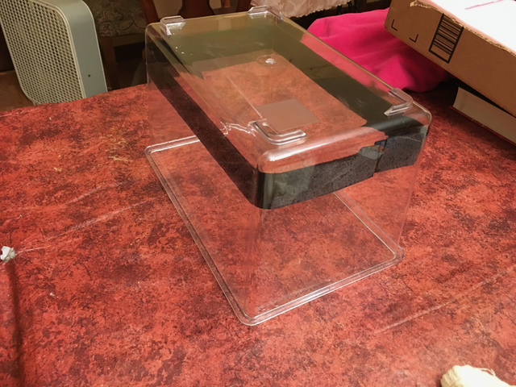
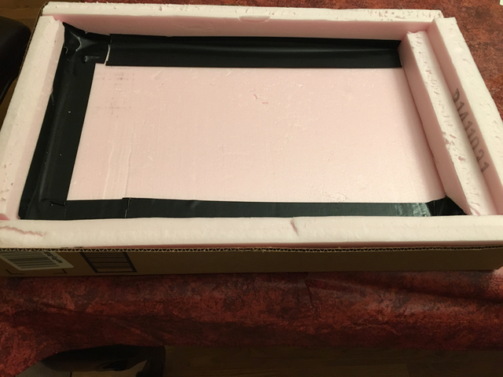
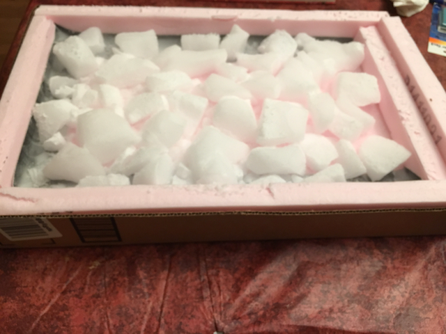
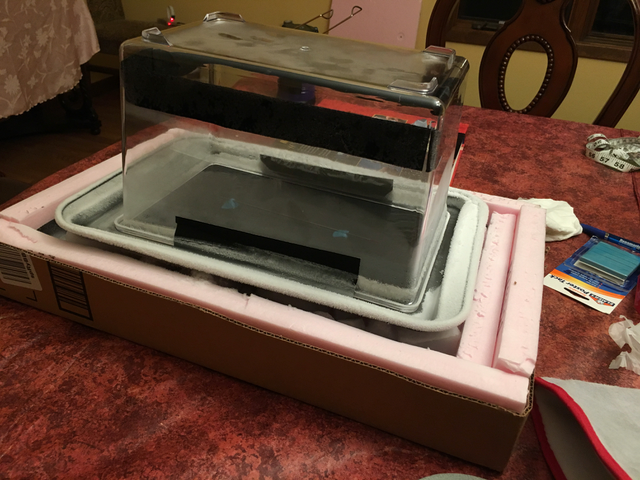
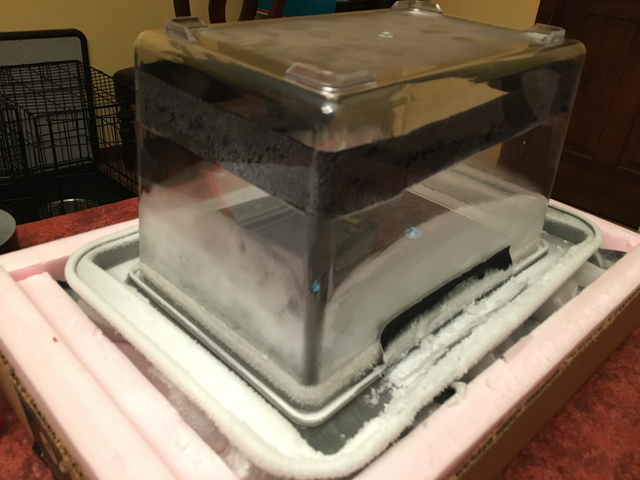

# Super easy cloud chamber

[Cloud chambers](https://en.wikipedia.org/wiki/Cloud_chamber) are what got me into a carrer in High Energy physics. I've been wanting to make one myself for quite awhile. There are many sets of instructions on the web...

* [Quarknet/Fermilab](http://quarknet.fnal.gov/resources/QN_CloudChamberV1_4.pdf) - they want you to build your own aquarium!
* [Symmetry magazine](http://www.symmetrymagazine.org/article/january-2015/how-to-build-your-own-particle-detector) has a nice article with a movie and a nice explanation of the differnent tracks you'll see, but lacks specifics (e.g. how big of a fish tank? What lid?)
* [Instructables](http://www.instructables.com/id/Make-a-Cloud-Chamber-using-Peltier-Coolers/) has one that uses a Peltier cooler instead of dry ice. Very cool (ha!) but complicated and expensive. You used to be able to buy an assembled chamber from a [company](http://www.nothinglabs.com/electroniccloudchamber/) that is now considering selling kits. 
* [Jefferson Lab](http://education.jlab.org/frost/cloud_chamber.html) has a nice video of making a small cloud chamber. They recommend you buy a radioactive source. Note that their series of science education videos are really great! 

I finally found a video and paper from [IOPScience](http://iopscience.iop.org/article/10.1088/0031-9120/47/3/338/meta) for a plastic fish tank chamber with instructions that were quite detailed. The whole thing looked very easy to put together. The paper is behind a pay-wall (sigh), but below I'll describe the Cloud Chamber my daughter and I built and the parts we used. 

## Parts

* Clear plastic fish tank. I bought [this one](http://www.carolina.com/animal-habitats/clear-view-plastic-aquariumterrarium-medium/674339B.pr?question=) online from Carolina, a biological supply company. Dimensions are 7-1/2" W × 11-1/4" L × 9-1/4" H and it costs a little over $10. It came to my house within a few days of ordering. Amazon doesn't seem to carry a plastic fish tank this size. 
* For the base, I bought this 9x13" small baking pan from [Amazon](https://www.amazon.com/gp/product/B00K4TH7TY/ref=oh_aui_detailpage_o01_s00?ie=UTF8&psc=1). It cost about $9.50. 
* You need black felt with an adhesive back. I got a sheet from [Amazon](https://www.amazon.com/gp/product/B0054G5XA2/ref=od_aui_detailpages00?ie=UTF8&psc=1). $4.60.
* Isopropyl alcohol is needed. The kind you buy at the drug store (usually 70%) will have too much water in it. 90% supposedly works, but 99% is best. I got a 16 oz bottle of 99% isopropyl alcohol from [Amazon](https://www.amazon.com/gp/product/B001B5JT8C/ref=od_aui_detailpages01?ie=UTF8&psc=1) for $8.70

In principle, the above and some dry ice (see below) is all you need. I got some extra stuff, all from Amazon, that have been helpful,

* A [wash bottle](https://www.amazon.com/gp/product/B005Z4RGQW/ref=od_aui_detailpages00?ie=UTF8&psc=1) is convenient for squirting the alcohol onto the felt. $5.09
* 2% Thoriated [welding rods](https://www.amazon.com/gp/product/B01BKYV9JU/ref=od_aui_detailpages00?ie=UTF8&psc=1) are a tiny bit radioactive and are a great source to put in the cloud chamber (the IOPScience article/movie uses them). I bought a pack of 10 for $11.49. Not sure what to do with the other nine welding rods. You can't buy just one.
* Blue tack or [poster tack](https://www.amazon.com/gp/product/B000BKQDB4/ref=od_aui_detailpages00?ie=UTF8&psc=1) is great for holding up the welding rod
* Good [gloves](https://www.amazon.com/gp/product/B06Y13FZ45/ref=od_aui_detailpages00?ie=UTF8&psc=1) for handling the dry ice. These are now apparently out of stock.
* The movie/article uses black duct tape. I didn't really need any. 

## Assembly

* The movie/article uses the lid of the fish tank as a snap-in base and they show how to cut a big hole in it. The lid that came with the tank from Carolina was impossible to cut (it melted with a rotary tool and splintered with a saw). We determined that we didn't really need it and discarded the lid.
* Cut the felt into 1 inch wide strips and stick it on the wall, towards the bottom, around the inside of the tank. Note that we'll use the tank upside down, so from now on I'll describe the tank in that configuration -- stick the felt on the wall towards the "top" of tank. See the picture .
* You don't want to put dry ice directly on your table, so prepare a base. I had a box from Amazon with length x width 19" x 12.5" (big enough to fit the banking sheet). We cut the bottom off with a box cutter so it is 2.5" high. In my basement I have some 1" thick foam board insulation (Foamular 150 - Home Depot [has it](http://www.homedepot.com/p/Project-Panels-FOAMULAR-1-in-x-2-ft-x-2-ft-R-5-Insulation-Sheathing-PP1/203553730)). We cut it so we could line the bottom with 1" foam board, leaving 1" open around the edge so we could cut 2.5" high strips along with walls. We then taped over the gaps with duct tape. We had an extra strip, so we put that in too. Here's a picture 

## Buying dry ice

The hardest part of this whole project was figuring out where to buy dry ice. Very few stores carry it (e.g. not Walmart, Costco, Target, Jewel supermarkets, nor Oberweis ice-cream). It turns out [Meijer](https://www.meijer.com/catalog/search_command.cmd?keyword=dry+ice&tierId=) sells dry ice and they'll actually have it if you don't go on a holiday like Memorial Day. I'm not sure if they get deliveries on the weekends. You'll need at least 5 lbs. To find dry ice in your area, look at [Store locator](http://dryiceideas.com). Contentintal Carbonic has several dry ice [stores](https://www.continentalcarbonic.com/where-to-buy-dry-ice19680.html) as well. In Illinois, you need to be 18 years of age or older to purchase dry ice (Meijer checks). 

## Safety

There are some safety issues,

* Hand protection: Dry ice is super cold and is dangerous to touch with bare hands. Use thick gloves. See above for some that I bought. Certainly don't eat dry ice!
* Eye protection: You don't want dry ice or isopropyl alcohol in your eyes. Wear eye protection when squirting the alcohol into the felt and when breaking up the dry ice
* Poison: For goodness sakes don't drink the isopropyl alcohol. It's not the kind of alcohol that makes you feel good. It will make you very sick or worse. 
* Radiation: The thoriated rods are very safe to handle and have so little radiation that they aren't a danger (see [here](http://www.twi-global.com/technical-knowledge/faqs/health-and-safety-faqs/faq-the-use-of-thoriated-tungsten-electrodes/) for more information). That being said, you should not eat them or grind them down or do other stupid things. 
* Other: Perhaps there are other safety issues not discussed here. By using these instructions you agree that I am not responsible for them. 

## Preparing the cloud chamber for a run

* With the blue/poster tack, prop up the thoriated rod on the baking sheet so it is a little above the sheet. You may want to put it in at a small angle to test how high the vapor layer goes.
* Break up the dry is into chunks (a hammer and screwdriver are useful - wear eye and hand protection) making a level surface in the try. See this picture 
* Put some isopropyl alcohol in the wash bottle and squirt it onto the felt all around the tank. You want the felt saturated, but not dripping. Wipe up any excess alcohol. Use eye protection. 
* Put the fish tank upside down (opening on the bottom) on top of the baking sheet and put the backing sheet on top of the dry ice. It will make some neat noises as the baking sheet shrinks slightly with the cold dry ice. 
* You may want to put a heavy book on top of the fish tank, just to hold everything down and ensure the fish tank is in good contact with the baking sheet (no gaps) and the banking sheet is in good contact with the dry ice. If there are gaps between the fish tank and the baking sheet, you can use duct tape to cover them. But when the tank gets cold the duct tape won't work well. We used duct tape at first, but didn't really need it.
* Turn off the lights
* Wait - it took about 15-20 minutes for things to cool down enough before we started seeing tracks. 
* You need a strong light source. The LED on my iPhone 6 on medium strengh worked great. 

Here are two pictures of the completed cloud chamber.

## Watch a movie

See https://www.youtube.com/watch?v=cFG3P-VRK4E for a movie of the cloud chamber in action!

## What's going on?

The isopropyl alcohol evaporates and the vapor falls from the felt to the bottom of the tank. The bottom is very cold and so you get a supersaturated cloud of alcohol vapor at the bottom of the tank. When a subatomic particle goes through the cloud, it ionizes the air (strips electrons off of atoms) along its path. The alcohol like to clump onto the resulting ions forming droplets, thus making a track that you can see. Cool!!!

See the [Symmetry magazine](http://www.symmetrymagazine.org/article/january-2015/how-to-build-your-own-particle-detector) article for an explanation of the different tracks you'll see. 
